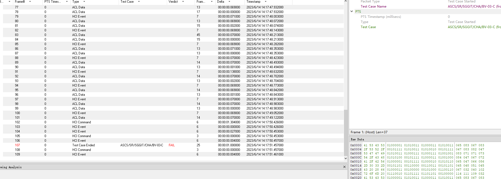
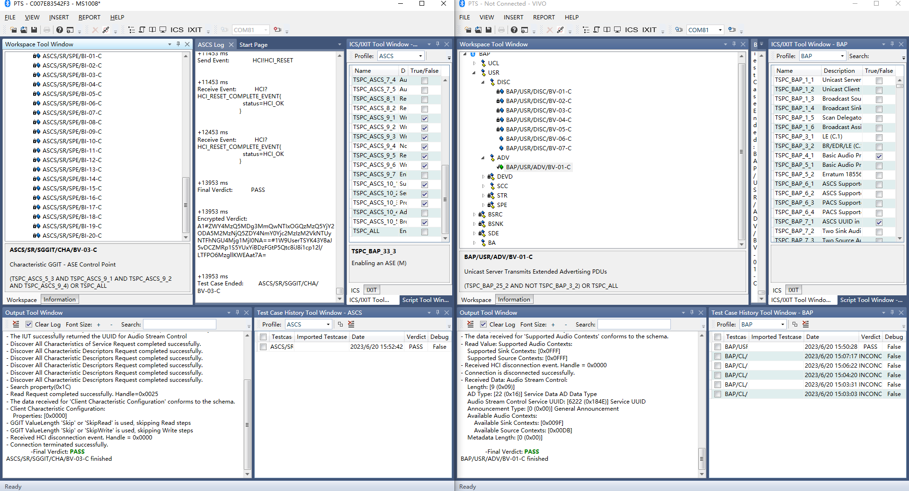
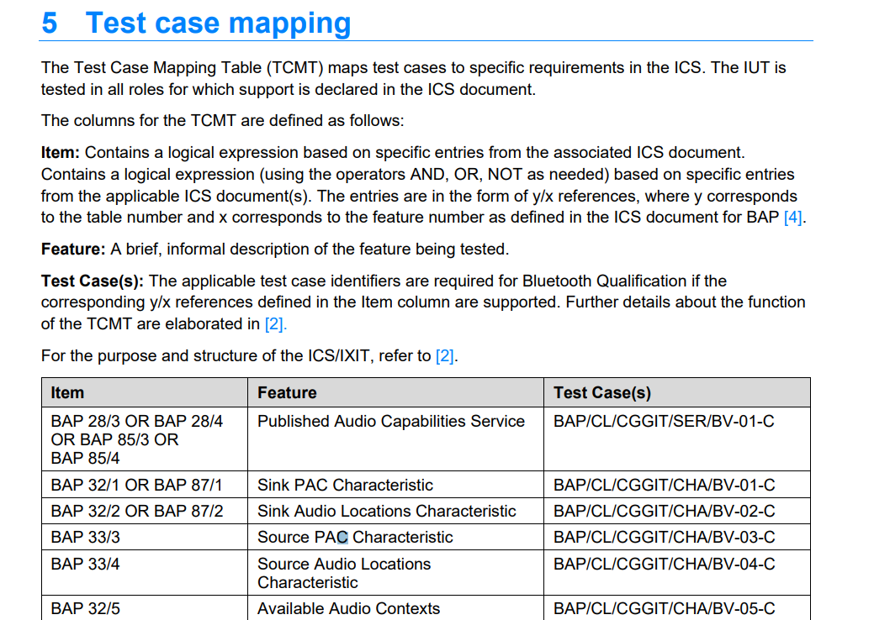
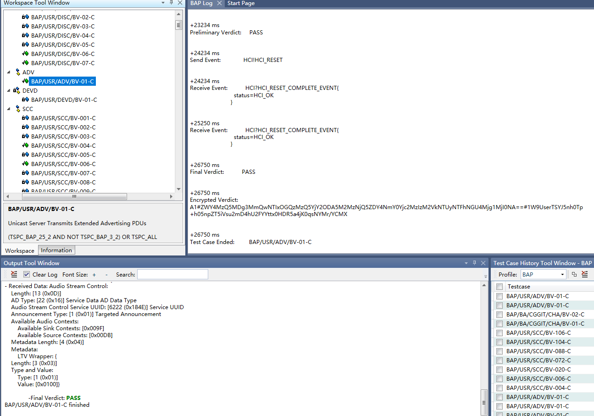

# TCL_BT_PTS
TCL_BT_PTS

https://pts.bluetooth.com/download

https://www.bluetooth.com/specifications/specs/

PTS部分需要公司的域名，如果公司之前已经注册过的，只需要在已经申请过域名记录上继续申请即可，很快可以注册，如果是没有申请过的公司，那就要很久了

工具使用需要使用公司域邮箱，没有用不了

安装全部工具到C:\Program Files (x86)\Bluetooth SIG

包括dongle的升级软件  PTS软件  PTS抓包软件 安装后抓包在PTS启动会跟着启动

PTS测试时，可以对比正常的设备抓取hci log进行分析

PTS测试的实例，可以在TS文档mapping找到对应

M选项是must必选的，O可以当作选项通过测试

